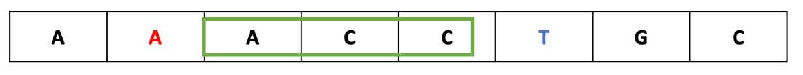
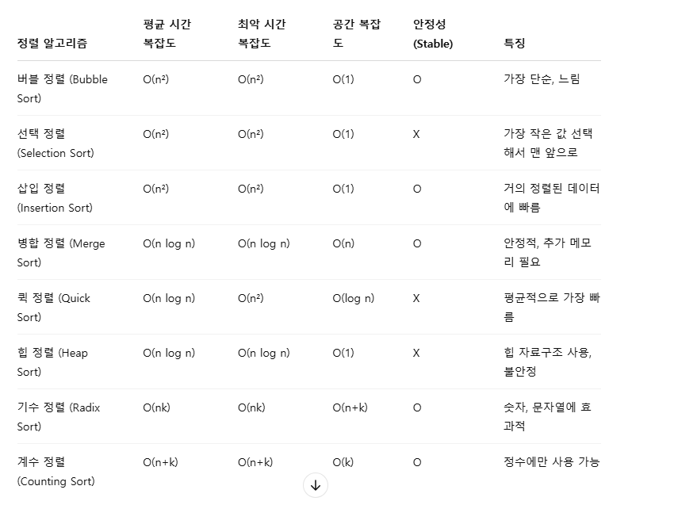
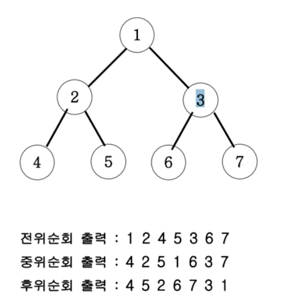
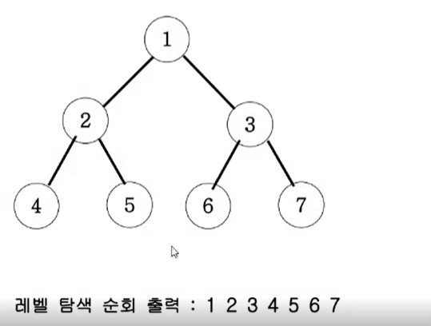

# 팰린드롬

# Two Pointers algorithm
- 리스트에 순차적으로 접근해야 할 때 두 개의 점의 위치를 기록하면서 처리하는 알고리즘
- 단 리스트는 정렬이 된상태에서 수행할 수 있다.
- [배열_합치기.java](src%2Fmain%2Fjava%2Flecture%2FcordingTest%2Fch2%2F%EB%B0%B0%EC%97%B4_%ED%95%A9%EC%B9%98%EA%B8%B0.java)
- [공통원소구하기.java](src%2Fmain%2Fjava%2Flecture%2FcordingTest%2Fch2%2F%EA%B3%B5%ED%86%B5%EC%9B%90%EC%86%8C%EA%B5%AC%ED%95%98%EA%B8%B0.java)
```java
private static int[] solution(int arrACnt, int[] arrA, int arrBCnt, int[] arrB) {
        int[] result = new int[arrACnt+arrBCnt];
        int aIndex = 0, bIndex = 0;
        for (int i = 0; i < result.length; i++) {
            if (arrA[aIndex] < arrB[bIndex]) {
                result[i] = arrA[aIndex++];
            }
            else {
                result[i] = arrB[bIndex++];
            }
        }
        return result;
    }
```

# Sliding window
- 배열과 그 부분배열을 어떤 조건하에서 계산하는 경우에 주로 사용된다. 예를 들어, 구간 합 구하기, 부분 문자열 구하기등에 활용될 수 있다

- [최대매출.java](src%2Fmain%2Fjava%2Flecture%2FcordingTest%2Fch2%2F%EC%B5%9C%EB%8C%80%EB%A7%A4%EC%B6%9C.java)

```java
private static int solution(int n, int m, int[] arr) {
    int doSum = 0;
    for (int i = 0; i < m; i++) {
        doSum += arr[i];
    }
    int maxAmount = doSum;

    for (int i = m; i < n; i++) {
        doSum = doSum + arr[i] - arr[i - m];
        maxAmount = Math.max(doSum, maxAmount);
    }
    return maxAmount;
}
```

# 후위식 연산 
- 앞에 있는 값이 앞으로 들어가는 것만 주의하면 된다. 
- 352+*9- = 12
```java
private static int solution(String text) {
    Deque<Integer> stack = new ArrayDeque<>();
    for (char c : text.toCharArray()) {
        // 352+*9-
        if(Character.isDigit(c)) stack.push(c-48);
        else {
            int rt = stack.pop();
            int lt = stack.pop();
            if(c == '-') stack.push(lt-rt);
            else if(c == '+') stack.push(lt+rt);
            else if(c == '*') stack.push(lt*rt);
            else if(c == '/') stack.push(lt/rt);
        }
    }
    return stack.getFirst();
}
```
# 정렬

## 선택정렬
- 선택 정렬(selection sort) 알고리즘
- 해당 순서에 원소를 넣을 위치는 이미 정해져 있고, 어떤 원소를 넣을지 선택하는 알고리즘
  첫 번째 순서에는 첫 번째 위치에 가장 최솟값을 넣는다.
  두 번째 순서에는 두 번째 위치에 남은 값 중에서의 최솟값을 넣는다.
```java
private static int[] solution(int n, int[] arr) {
    for (int i = 0; i < n - 1; i++) {
        int idx = i;
        for (int j = i + 1; j < n; j++) {
            if (arr[idx] > arr[j]) {
                idx = j;
            }
        }
        if (idx != i) {
            int temp = arr[i];
            arr[i] = arr[idx];
            arr[idx] = temp;
        }
    }
    return arr;
}
```

## 버블정렬
- 서로 인접한 두 원소를 검사하여 정렬하는 알고리즘
  인접한 2개의 레코드를 비교하여 크기가 순서대로 되어 있지 않으면 서로 교환한다.
- 주의사항: 회차 종료시마다 마지막 데이터가 정렬되는 방법이다. 
```java
private static int[] solution(int n, int[] arr) {
    for (int i = 0; i < n - 1; i++) {
        for (int j = 0; j < n-i-1; j++) {
            if (arr[j] > arr[j+1]) {
                int temp = arr[j+1];
                arr[j+1] = arr[j];
                arr[j] = temp;
            }
        }
    }
    return arr;
}
```

## 삽입정렬
- 삽입 정렬은 두 번째 자료부터 시작하여 그 앞(왼쪽)의 자료들과 비교하여 삽입할 위치를 지정한 후 자료를 뒤로 옮기고 지정한 자리에 자료를 
  삽입하여 정렬하는 알고리즘이다.

```java
private static int[] solution(int n, int[] arr) {
  for (int i = 1; i < n; i++) {
    int temp = arr[i];
    int j = i-1;
    for (; j >= 0; j--) {
      if (arr[j] > temp) {
        arr[j+1] = arr[j];
      } else break;
    }
    arr[j+1] = temp;
  }
  return arr;
}
```

# 이분 탐색
- 이분 탐색이란 중간값을 기준으로 탐색의 범위를 설정하여 찾고자하는 값을 찾아내는 탐색법
- 

# 결정 알고리즘 
- 결정 알고리즘은 이분 탐색을 이용한 알고리즘
- 전재조건: 구하고자하는 값이 LT, RT 사이에 반드시 존재하는 경우 사용할 수 있다. 
- LT, RT 로 구한 MID 값이 답으로 사용할 수 있는가 없는 가를 확인하여 LT, RT 의 값을 변경하게 된다. 
```java
private static int solution(int size, int count, int[] arr) {
    int answer = 0;
    int rt = Arrays.stream(arr).sum();
    int lt = Arrays.stream(arr).max().getAsInt();
    while (lt <= rt) {

        int mid = (lt + rt) / 2;
        if (divide(arr, mid) <= count) {
            answer = mid;
            rt = mid - 1;
        } else {
            lt = mid + 1;
        }
    }
    return answer;
}
```

# 재귀 함수 (recursive)

- 팩토리얼 재귀함수
```java
private static int recursive(int n) {
  if(n <= 1) return 1;
  return recursive(n-1) * n;
}
```

## 이진트리 순회 
- 전위, 중위, 후위 순회 방법이 있으며, 부모 노드에 위치에 따라 이름이 붙일 수 있다. 

```java
private static void 전위순회(Node node) {
    System.out.print(node.value + " ");
    if(node.left != null) 전위순회(node.left);
    if(node.right != null) 전위순회(node.right);
}

private static void 중위순회(Node node) {
    if(node.left != null) 중위순회(node.left);
    System.out.print(node.value + " ");
    if(node.right != null) 중위순회(node.right);
}

private static void 후위순회(Node node) {
    if(node.left != null) 후위순회(node.left);
    if(node.right != null) 후위순회(node.right);
    System.out.print(node.value + " ");
}
```

## 부분집합 
- 

# DFS : 깊이우선 탐색
# BFS : 상태트리탐색
- 너비우선 탐색 
