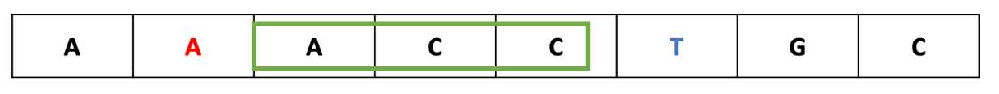

# 팰린드롬

# Two Pointers algorithm
- 리스트에 순차적으로 접근해야 할 때 두 개의 점의 위치를 기록하면서 처리하는 알고리즘
- 단 리스트는 정렬이 된상태에서 수행할 수 있다.
- [배열_합치기.java](src%2Fmain%2Fjava%2Flecture%2FcordingTest%2Fch2%2F%EB%B0%B0%EC%97%B4_%ED%95%A9%EC%B9%98%EA%B8%B0.java)
- [공통원소구하기.java](src%2Fmain%2Fjava%2Flecture%2FcordingTest%2Fch2%2F%EA%B3%B5%ED%86%B5%EC%9B%90%EC%86%8C%EA%B5%AC%ED%95%98%EA%B8%B0.java)
```java
private static int[] solution(int arrACnt, int[] arrA, int arrBCnt, int[] arrB) {
        int[] result = new int[arrACnt+arrBCnt];
        int aIndex = 0, bIndex = 0;
        for (int i = 0; i < result.length; i++) {
            if (arrA[aIndex] < arrB[bIndex]) {
                result[i] = arrA[aIndex++];
            }
            else {
                result[i] = arrB[bIndex++];
            }
        }
        return result;
    }
```

# Sliding window
- 배열과 그 부분배열을 어떤 조건하에서 계산하는 경우에 주로 사용된다. 예를 들어, 구간 합 구하기, 부분 문자열 구하기등에 활용될 수 있다

- [최대매출.java](src%2Fmain%2Fjava%2Flecture%2FcordingTest%2Fch2%2F%EC%B5%9C%EB%8C%80%EB%A7%A4%EC%B6%9C.java)

```java
private static int solution(int n, int m, int[] arr) {
    int doSum = 0;
    for (int i = 0; i < m; i++) {
        doSum += arr[i];
    }
    int maxAmount = doSum;

    for (int i = m; i < n; i++) {
        doSum = doSum + arr[i] - arr[i - m];
        maxAmount = Math.max(doSum, maxAmount);
    }
    return maxAmount;
}
```

# 후위식 연산 
- 앞에 있는 값이 앞으로 들어가는 것만 주의하면 된다. 
- 352+*9- = 12
```java
private static int solution(String text) {
    Deque<Integer> stack = new ArrayDeque<>();
    for (char c : text.toCharArray()) {
        // 352+*9-
        if(Character.isDigit(c)) stack.push(c-48);
        else {
            int rt = stack.pop();
            int lt = stack.pop();
            if(c == '-') stack.push(lt-rt);
            else if(c == '+') stack.push(lt+rt);
            else if(c == '*') stack.push(lt*rt);
            else if(c == '/') stack.push(lt/rt);
        }
    }
    return stack.getFirst();
}
```
