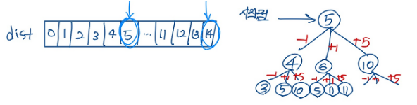
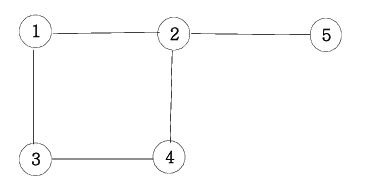
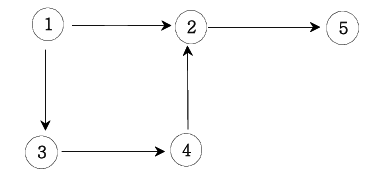

# 팰린드롬

# Two Pointers algorithm
- 리스트에 순차적으로 접근해야 할 때 두 개의 점의 위치를 기록하면서 처리하는 알고리즘
- 단 리스트는 정렬이 된상태에서 수행할 수 있다.
- [배열_합치기.java](src%2Fmain%2Fjava%2Flecture%2FcordingTest%2Fch2%2F%EB%B0%B0%EC%97%B4_%ED%95%A9%EC%B9%98%EA%B8%B0.java)
- [공통원소구하기.java](src%2Fmain%2Fjava%2Flecture%2FcordingTest%2Fch2%2F%EA%B3%B5%ED%86%B5%EC%9B%90%EC%86%8C%EA%B5%AC%ED%95%98%EA%B8%B0.java)
```java
private static int[] solution(int arrACnt, int[] arrA, int arrBCnt, int[] arrB) {
        int[] result = new int[arrACnt+arrBCnt];
        int aIndex = 0, bIndex = 0;
        for (int i = 0; i < result.length; i++) {
            if (arrA[aIndex] < arrB[bIndex]) {
                result[i] = arrA[aIndex++];
            }
            else {
                result[i] = arrB[bIndex++];
            }
        }
        return result;
    }
```

# Sliding window
- 배열과 그 부분배열을 어떤 조건하에서 계산하는 경우에 주로 사용된다. 예를 들어, 구간 합 구하기, 부분 문자열 구하기등에 활용될 수 있다

- [최대매출.java](src%2Fmain%2Fjava%2Flecture%2FcordingTest%2Fch2%2F%EC%B5%9C%EB%8C%80%EB%A7%A4%EC%B6%9C.java)

```java
private static int solution(int n, int m, int[] arr) {
    int doSum = 0;
    for (int i = 0; i < m; i++) {
        doSum += arr[i];
    }
    int maxAmount = doSum;

    for (int i = m; i < n; i++) {
        doSum = doSum + arr[i] - arr[i - m];
        maxAmount = Math.max(doSum, maxAmount);
    }
    return maxAmount;
}
```

# 후위식 연산 
- 앞에 있는 값이 앞으로 들어가는 것만 주의하면 된다. 
- 352+*9- = 12
```java
private static int solution(String text) {
    Deque<Integer> stack = new ArrayDeque<>();
    for (char c : text.toCharArray()) {
        // 352+*9-
        if(Character.isDigit(c)) stack.push(c-48);
        else {
            int rt = stack.pop();
            int lt = stack.pop();
            if(c == '-') stack.push(lt-rt);
            else if(c == '+') stack.push(lt+rt);
            else if(c == '*') stack.push(lt*rt);
            else if(c == '/') stack.push(lt/rt);
        }
    }
    return stack.getFirst();
}
```
# 정렬

## 선택정렬
- 선택 정렬(selection sort) 알고리즘
- 해당 순서에 원소를 넣을 위치는 이미 정해져 있고, 어떤 원소를 넣을지 선택하는 알고리즘
  첫 번째 순서에는 첫 번째 위치에 가장 최솟값을 넣는다.
  두 번째 순서에는 두 번째 위치에 남은 값 중에서의 최솟값을 넣는다.
```java
private static int[] solution(int n, int[] arr) {
    for (int i = 0; i < n - 1; i++) {
        int idx = i;
        for (int j = i + 1; j < n; j++) {
            if (arr[idx] > arr[j]) {
                idx = j;
            }
        }
        if (idx != i) {
            int temp = arr[i];
            arr[i] = arr[idx];
            arr[idx] = temp;
        }
    }
    return arr;
}
```

## 버블정렬
- 서로 인접한 두 원소를 검사하여 정렬하는 알고리즘
  인접한 2개의 레코드를 비교하여 크기가 순서대로 되어 있지 않으면 서로 교환한다.
- 주의사항: 회차 종료시마다 마지막 데이터가 정렬되는 방법이다. 
```java
private static int[] solution(int n, int[] arr) {
    for (int i = 0; i < n - 1; i++) {
        for (int j = 0; j < n-i-1; j++) {
            if (arr[j] > arr[j+1]) {
                int temp = arr[j+1];
                arr[j+1] = arr[j];
                arr[j] = temp;
            }
        }
    }
    return arr;
}
```

## 삽입정렬
- 삽입 정렬은 두 번째 자료부터 시작하여 그 앞(왼쪽)의 자료들과 비교하여 삽입할 위치를 지정한 후 자료를 뒤로 옮기고 지정한 자리에 자료를 
  삽입하여 정렬하는 알고리즘이다.

```java
private static int[] solution(int n, int[] arr) {
  for (int i = 1; i < n; i++) {
    int temp = arr[i];
    int j = i-1;
    for (; j >= 0; j--) {
      if (arr[j] > temp) {
        arr[j+1] = arr[j];
      } else break;
    }
    arr[j+1] = temp;
  }
  return arr;
}
```

# 이분 탐색
- 이분 탐색이란 중간값을 기준으로 탐색의 범위를 설정하여 찾고자하는 값을 찾아내는 탐색법
- 

# 결정 알고리즘 
- 결정 알고리즘은 이분 탐색을 이용한 알고리즘
- 전재조건: 구하고자하는 값이 LT, RT 사이에 반드시 존재하는 경우 사용할 수 있다. 
- LT, RT 로 구한 MID 값이 답으로 사용할 수 있는가 없는 가를 확인하여 LT, RT 의 값을 변경하게 된다. 
```java
private static int solution(int size, int count, int[] arr) {
    int answer = 0;
    int rt = Arrays.stream(arr).sum();
    int lt = Arrays.stream(arr).max().getAsInt();
    while (lt <= rt) {

        int mid = (lt + rt) / 2;
        if (divide(arr, mid) <= count) {
            answer = mid;
            rt = mid - 1;
        } else {
            lt = mid + 1;
        }
    }
    return answer;
}
```

# 재귀 함수 (recursive)

- 팩토리얼 재귀함수
```java
private static int recursive(int n) {
  if(n <= 1) return 1;
  return recursive(n-1) * n;
}
```

## 이진트리 순회 
- 전위, 중위, 후위 순회 방법이 있으며, 부모 노드에 위치에 따라 이름이 붙일 수 있다. 

```java
private static void 전위순회(Node node) {
    System.out.print(node.value + " ");
    if(node.left != null) 전위순회(node.left);
    if(node.right != null) 전위순회(node.right);
}

private static void 중위순회(Node node) {
    if(node.left != null) 중위순회(node.left);
    System.out.print(node.value + " ");
    if(node.right != null) 중위순회(node.right);
}

private static void 후위순회(Node node) {
    if(node.left != null) 후위순회(node.left);
    if(node.right != null) 후위순회(node.right);
    System.out.print(node.value + " ");
}
```

## 부분집합 
- 

# DFS : 깊이우선 탐색
- 너비우선 탐색 


# BFS : 넒이우선탐색: 레벨 탐색
- 레벨 탐색은 Que 를 사용한다. 


```java
private static void bfs(Node node) {
    Queue<Node> q = new LinkedList<>();
    q.offer(node);
    while (!q.isEmpty()) {
        int len = q.size();
        for (int i = 0; i < len; i++) {
            Node currentNode = q.poll();
            System.out.print(currentNode.value + " ");
            if(currentNode.left != null) q.offer(currentNode.left);
            if(currentNode.right != null) q.offer(currentNode.right);
        }
    }
}
```

# 그래프와 인접행렬
- 무방향 그래프 


- 방향 그래프 


- 가중치 그래프

# ch8 
## 1 합이 같은 부분집합 (DFS)
> 설명
N개의 원소로 구성된 자연수 집합이 주어지면, 이 집합을 두 개의 부분집합으로 나누었을 때
두 부분집합의 원소의 합이 서로 같은 경우가 존재하면 “YES"를 출력하고, 그렇지 않으면 ”NO"를 출력하는 프로그램을 작성하세요.  
둘로 나뉘는 두 부분집합은 서로소 집합이며, 두 부분집합을 합하면 입력으로 주어진 원래의 집합이 되어 합니다.  
예를 들어 {1, 3, 5, 6, 7, 10}이 입력되면 {1, 3, 5, 7} = {6, 10} 으로 두 부분집합의 합이 16으로 같은 경우가 존재하는 것을 알 수 있다.

### 풀이
- DFS 알고리즘을 사용하여 처리하는 방식
- 전체 원소들의 합/2 를 먼저 찾는 작업을 수행한다.

### 주의사항
- index 가 전체 길이보다 길어지는것을 조심
- sum 이 홀수인 경우 문제자체가 성립되지 않는다. 

```java
public class 경로탐색_인접리스트_11 {

    private static List<Integer>[] graph;
    private static int[] history;
    private static int ret;
    private static int n;
    public static void main(String[] args) {
        Scanner scanner = new Scanner(System.in);
        n = scanner.nextInt();
        int trunk = scanner.nextInt();

        graph = new ArrayList[n + 1];//new int[n+1][n+1];
        history  = new int[n+1];

        for (int i = 0; i < n + 1; i++) {
            graph[i] = new ArrayList<>();
        }
        for (int i = 1; i <= trunk; i++) {
            List<Integer> list = graph[scanner.nextInt()];

            list.add(scanner.nextInt());
        }
        history[1] = 1;
        dfs(1);
        System.out.println(ret);
    }

    private static void dfs(int node) {

        if (node == n) {
            ret++;
            return;
        }

        for (Integer i : graph[node]) {
            if (history[i] == 0) {
                history[i] = 1;
                dfs(i);
                history[i] = 0;
            }
        }
    }
}
```

## 2 바둑이 승자 DFS
### 설명
> 철수는 그의 바둑이들을 데리고 시장에 가려고 한다. 그런데 그의 트럭은 C킬로그램 넘게 태울수가 없다.  
철수는 C를 넘지 않으면서 그의 바둑이들을 가장 무겁게 태우고 싶다.  
N마리의 바둑이와 각 바둑이의 무게 W가 주어지면, 철수가 트럭에 태울 수 있는 가장 무거운 무게를 구하는 프로그램을 작성하세요.

### 풀이 
- DFS 로 깊이 탐색을 하면서 C 를 넘지않는 무게를 계속 측정한다. 
- 이 경우도 for 문 전체를 찾는 것이 아니라 다음 index 만 찾는 결정 알고리즘과 비슷

### 주의
- 제한조건을 걸다가 계속 빠지는 데이터가 발생할 수 있음
- 배열의 index 길이 고민

```java
private static void dfs(int index, int sum){
    if(index >= arr.length) return;
    int tempTotal = sum + arr[index];
    if (tempTotal <= max) {
        total = Math.max(total, tempTotal);
        dfs(index+1, tempTotal);
    }
    // 주의 tempTotal 생각하다가 이부분에서 계속 빠지는 데이터가 발생함 
    dfs(index+1, sum);
}
```
### 3 최대점수구하기
#### 설명
> 이번 정보올림피아드대회에서 좋은 성적을 내기 위하여 현수는 선생님이 주신 N개의 문제를 풀려고 합니다.  
    각 문제는 그것을 풀었을 때 얻는 점수와 푸는데 걸리는 시간이 주어지게 됩니다.  
    제한시간 M안에 N개의 문제 중 최대점수를 얻을 수 있도록 해야 합니다.    
    (해당문제는 해당시간이 걸리면 푸는 걸로 간주한다, 한 유형당 한개만 풀 수 있습니다.)

#### 풀이
- 최대점수를 DFS 알고리즘을 사용하여 구하는 문제 
- score, min 배열을 따로 정의하는 것 이외에는 DPS 특이사항 없다. 

```java
private static void solution(int index, int score, int min) {
    if (min > m) return;
    if (index == scores.length) {
        answer = Math.max(answer, score);
    } else {
        solution(index+1, score+scores[index], min+mines[index]);
        solution(index+1, score, min);
    }
}
```
### 4 중복순열구하기 
#### 설명
> 1부터 N까지 번호가 적힌 구슬이 있습니다. 이 중 중복을 허락하여 M번을 뽑아 일렬로 나열 하는 방법을 모두 출력합니다

#### 풀이
- dfs 방식을 사용하여 순차적으로 중복 순열을 추출한다. 

```java
static void dfs(int depth){
    if (depth == M) {
        addList();
    } else {
        for (int i = 1; i <= N; i++) {
            pm[depth] = i;
            dfs(depth + 1);
        }
    }
}
```

### 5 동전구하기
#### 설명
> 다음과 같이 여러 단위의 동전들이 주어져 있을때 거스름돈을 가장 적은 수의 동전으로 교환해주려면 어떻게 주면 되는가?
각 단위의 동전은 무한정 쓸 수 있다.

#### 풀이 
- 가장 적은 수, 최소 몇번에 이런 문제는 BFS 를 사용하여 풀이할 수 있다. 
- 일반적인 문제와 차이점은 동일한 item 을 무한이 사용할 수 있다는 점이다.
```java
static int bfs() {
    Queue<Integer> arrayDeque = new ArrayDeque<>();
    int level = 0;
    for (int coin : coins) {
        arrayDeque.add(coin);
    }

    while (!arrayDeque.isEmpty()) {
        level++;
        int len = arrayDeque.size();
        for (int i = 0; i < len; i++) {
            Integer item = arrayDeque.poll();
            if (item == M) return level;
            // 거스름돈보다 큰경우에는 스킵한다.
            else if (item < M){
                for (int coin : coins) {
                    arrayDeque.add(item + coin);
                }
            }
            
        }
    }
    return 0;
}
```


### 6 순열구하기
> 10이하의 N개의 자연수가 주어지면 이 중  M개를 뽑아 일렬로 나열하는 방법을 모두 출력합니다.

#### 풀이 
- 중복 순열과 다르게 중복을 허용하지 않는 것만 조심하여 처리하면 된다. DFS 방식으로
- 배열이 아닌 리스트를 사용한 이유는 remove, contain 같은 Collection 메서드를 사용하기 위해 
- 입력 순서를 보장하는 Set을 사용해도 될 것 같아
- 배열 check 하는 데이터를 만들어서 처리해도 된다. (리스트 사용하지 않고..)

```java
static void dfs(int l, List<Integer> list) {

    if (l == M) {
        for (Integer i : list) {
            System.out.print(i + " ");
        }
        System.out.println();
    } else {
        for (int i = 0; i < N; i++) {
            if(!list.contains(arr[i])){
                list.add(arr[i]);
                dfs(l + 1, list);
                list.remove(l);
            }
        }
    }
}
```

### 7 조합의 경우의 수
### 설명 
> 재귀를 이용해 조합수를 구해주는 프로그램을 작성하세요.

### 풀이 
- 중복 가능한 n개중에서 r개를 선택하는 경우의 수를 구하는 방법
- 별도의 공식이 존재하지만 재귀를 이용하여 조합수를 구할 수 있다. 
- r=1 으로 1개를 선택하는 경우 당연하게 n개의 방법이 존재
- n=r 인 경우에 예를 들어 3개중에서 3개를 선택하는 경우기에 1개 방법만 존재 
- 이를 이용하여 다음과 같이 풀이를 할 수 있다.
- 강의를 듣고 이전에 계산 값을 저장하는 배열만 추가하자

```java
static int recursion(int n, int r) {
    if(r == 1) return n;
    if(n == r) return 1;
    return recursion(n - 1, r - 1) + recursion(n - 1, r);
}
```

### 10. 미로 탐색 
#### 설명 
> 7*7 격자판 미로를 탈출하는 경로의 가지수를 출력하는 프로그램을 작성하세요.    
> 출발점은 격자의 (1, 1) 좌표이고, 탈출 도착점은 (7, 7)좌표이다. 격자판의 1은 벽이고, 0은 통로이다.   
> 격자판의 움직임은 상하좌우로만 움직인다

#### 풀이 
- 전체 경로의 길이를 구하는 문제로 DFS 방식으로 풀이할 수 있다. 
- 방문가능한 노드를 방문하면서 최종 노드에 도착하면 ret ++ 하는 방식
```java
static void dfs(int y, int x) {
    if (x == COUNT - 1 && y == COUNT - 1) {
        ret++;
    } else {
        for (int i = 0; i < 4; i++) {
            int y2 = y + Y[i];
            int x2 = x + X[i];
            if (x2 >= 0 && y2 >= 0 && x2 < 7 && y2 < 7 && miro[y2][x2] == 0) {
                miro[y2][x2] = 1;
                dfs(y2, x2);
                miro[y2][x2] = 0;
            }
        }
    }
}
```

### 11. 미로최단 검색 
#### 설명 
>  7*7 격자판 미로를 탈출하는 최단경로의 길이를 출력하는 프로그램을 작성하세요.   
> 경로의 길이는 출발점에서 도착점까지 가는데 이동한 횟수를 의미한다.   
> 출발점은 격자의 (1, 1) 좌표이고, 탈출 도착점은 (7, 7)좌표이다. 격자판의 1은 벽이고, 0은 도로이다
> 좀 더 빨리 찾기 위해서 경로는 탐색하는 순서를 우 > 좌, 하 > 상으로 하는게 더 빠르게 찾을 수 있다.
> dis[nx][ny] = dis[x][y] + 1;
#### 풀이 
- 최단 거리는 BFS 방식으로 풀이할 수 있다. 
- Queue 를 사용하여 처리하고 있으면 Level 마다 체크하고 결과가 나오면 강제 종료하자 

```java
static int bfs() {

    Queue<Point> points = new ArrayDeque<>();
    points.add(new Point(0, 0));

    while (!points.isEmpty()) {
        int len = points.size();
        for (int i = 0; i < len; i++) {
            Point point = points.poll();
            if(point.isLast()) {
                return L;
            } else {
                miro[point.x][point.y] = 1;
                for (int j = 0; j < 4; j++) {
                    Point next = point.next(X[j], Y[j]);
                    if (next.isNode()) points.add(next);
                }
            }
        }
        L++;
    }
    return 0;
}
```


# 9 그리디 알고리즘 
- 현재 상황에서 가장 좋은 것을 선택하는 방법

## 9.1 씨름선수
### 설명 
> 각 지원자의 키와 몸무게 정보를 알고 있습니다.  
> “A라는 지원자를 다른 모든 지원자와 일대일 비교해서 키와 몸무게 모두 A지원자 보다 높은
(크고, 무겁다) 지원자가 존재하면 A지원자는 탈락하고, 그렇지 않으면 선발된다.”  
> N명의 지원자가 주어지면 위의 선발원칙으로 최대 몇 명의 선수를 선발할 수 있는지 알아내는
프로그램을 작성하세요.

### 풀이
- 지원자의 키를 기준으로 내림차순 정렬한다. 
- 순차적으로 순외하면서 몸무게가 적게 나가는 데이터를 제외하면 된다. 

## 9.2 회의실
### 설명 
> 한 개의 회의실이 있는데 이를 사용하고자 하는 n개의 회의들에 대하여 회의실 사용표를 만들
려고 한다. 각 회의에 대해 시작시간과 끝나는 시간이 주어져 있고, 각 회의가 겹치지 않게 하
면서 회의실을 사용할 수 있는 최대수의 회의를 찾아라. 단, 회의는 한번 시작하면 중간에 중
단될 수 없으며 한 회의가 끝나는 것과 동시에 다음 회의가 시작될 수 있다.

### 풀이
- 회의가 종료되는 시간으로 오름차순 정렬한다. (단 같은경우는 시작시간에 따라 정렬한다. )
- 그리고 이전회의 종료시간과 다음회의 시작시간을 비교하여 회의가 가능한지 확인한다.

```java
static int solution(Meeting[] arr) {
    Arrays.sort(arr);
    int ret = 0;
    int lastTime = 0;
    for (Meeting meeting : arr) {
        if (meeting.startTime >= lastTime) {
            ret++;
            lastTime = meeting.endTime;
        }
    }
    return ret;
}
```


## 9.3 결혼식
### 설명 
> 현수는 이 정보를 바탕으로 피로연 장소에 동시에 존재하는 최대 인원수를 구하여 그 인원을 수용할 수 있는 장소를 빌리려고 합니다. 여러분이 현수를 도와주세요.
만약 한 친구가 오는 시간 13, 가는시간 15라면 이 친구는 13시 정각에 피로연 장에 존재하는 것이고 15시 정각에는 존재하지 않는다고 가정합니다.


### 풀이
- 입력받을 떄 시간, INOUT 구분으로 입력을 받는다.
- 시간 오름차순 In < out 으로 정렬한다. 
- 순차적으로 돌려면 Queue 처럼 더하거나 빼면서 최대 인원을 구할 수 있다. 


```java
static int solution(Friend[] friends) {
    Arrays.sort(friends);
    int maxCount = 0;
    int currentCount = 0;

    for (Friend friend : friends) {
        currentCount += friend.inAndOut;
        maxCount = Math.max(maxCount, currentCount);
    }

    return maxCount;
}
```

### 9.4 다익스트라 알고리즘
- 음의 가중치(음의 간선, 음의 값)가 없는 그래프의 한 노드에서 각 모든 노드까지의 최단거리를 구하는 알고리즘을 말한다.
- 초기 모델은 O(V^2)의 시간복잡도를 가졌다. 이후 우선순위 큐 등을 이용한 고안된 알고리즘이 탄생했고, 현재는 O((V+E)log V)의 시간복잡도를 가지고 있다


## Disjoint-Set : Union&Find
서로소 집합(Disjoint Set)
> 서로소 집합 자료구조는 상호 배타적으로 이루어진 집합(서로소 집합 : 공통 원소가 없는 두 집합)을 효율적으로 표현하기 위해 만들어진 자료구조이다.  
> 서로소 집합은 서로 다른 두 개의 집합을 병합하는 연산(Union)(Merge)과 집합의 원소가 어떤 집합에 속해 있는지 판단하는 연산(Find)을 기반으로 구현되기 때문에, Union-Find 혹은 Merge-Find Set이라고도 불린다.  
> 서로소 집합을 구현하는 방법은 연결 리스트를 이용하는 방법과, 트리를 이용하는 방법이 있는데, 이 글에서는 트리를 이용하는 방법에 대해서만 다룬다.  

