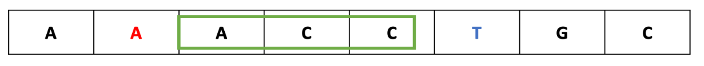
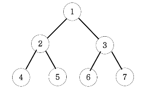

# 1. 문자열 
 
## 1.1 일부 문자 변경 이나 순서 조절  
- 문자열 처리시에 char[] 로 변경해서 처리하는 것이 속도 측면에 좋음 
- 숫자, 영어 대소문자에 대한 아스키 코드를 기억하자 

| 타입| 아스키 코드|
| --| --|
| 0| 48|
| 9| 57|
| A| 65|
| Z| 90|
| a| 97|
| z| 122|

## ex 펠린드롬
- 앞 뒤가 동잃한 문자열을 펠린드롬이라고 한다. `이효리`
- 문자열 반복시에 반만 돌릴수 있는 방법을 항상 고민하자 
```java
public static boolean 펠린드롬(String word) {
    String lowerCase = word.toLowerCase();
    int leftIndex = 0, rightIndex = word.length() -1;

    while (leftIndex < rightIndex) {
        if (lowerCase.charAt(leftIndex) != lowerCase.charAt(rightIndex)) {
            return false;
        }
        leftIndex++;
        rightIndex--;
    }
    return true;
}
```

# 2. 배열 
- 2중 배열에서 행/열 구분을 잘 하자 x가 행이고 y가 열이며, int[y][x] 로 구분 된다. 
- 2중 반복문에서 y 축 먼저 roof 를 수행하게 된다.


## ex 피보나치 수열
- 피보나치 수열은 앞에 2개의 수를 더한 값이 다음 수가 되는 수열이다.
```java
public static int[] 피보나치(int size) {
    int[] result = new int[size];
    result[1] = 1;
    result[2] = 1;
    for (int i = 3; i < size; i++) {
        result[i] = result[i - 1] + result[i - 2];
    }
    return result;
}
```

## ex 에라토스테네스체 (소수)
- 에라토스테네스체는 특정 수까지의 소수를 구하는 빠른 방법이다. 
- 2부터 배수마다 표기를 하여 소수를 구분하는 방법으로 2(4,6,8,10..), 3(6,9,12,15..) 로 배수의 경우 소수에서 제외하는 방법
```java
public static int solution(int size) {
    int[] items = new int[size+1];
    int result = 0;
    for (int i = 2; i <= size; i++) {
        if(items[i] == 0) {
            result++;
            for (int j = i; j <= size; j = j + i) {
                items[j] = 1;
            }
        }
    }
    return result;
}
```

## ex 소수 여부 확인 하기
- 소수는 특정 규칙을 찾을 수 없는 수열이다
- 2부터 자기자신을 2로 나눈 수까지 나머지가 0이 나오면 소수가 아니다.

```java
private static boolean isPrime(int number) {
    if (number < 2) {
        return false;
    }
        
    int half = number/2;
    for (int i = 2; i < half; i++) {
        if (number % i == 0) {
            return false;
        }
    }
    return true;
}
```

# 3.1 Two-Pointers Algorithm
- 1차원 배열에서 각자 다른 원소를 가리키고 있는 2개의 포인터를 조작해가면서 원하는 값을 찾을 때 까지 탐색하는 알고리즘이다.
- 리스트에 순차적으로 접근해야 할 때 두 개의 점(포인트)의 위치를 기록하면서 처리한다.


## ex 공통원소구하기
- 정렬되지 않은 2개의 배열에서 합집합을 구하는 예제
- 먼저 배열을 정렬하고 left, right 2개의 포인터를 가지고 합집합의 크기를 계산한다.

```java
private static List<Integer> solution(int arrACnt, int[] arrA, int arrBCnt, int[] arrB) {
    Arrays.sort(arrA);
    Arrays.sort(arrB);

    List<Integer> answer = new ArrayList<>();
    int left = 0, rigth = 0;
    while(left < arrACnt && rigth < arrBCnt) {
        if (arrA[left] == arrB[rigth]) {
            answer.add(arrA[left++]);
            rigth++;
        }
        else if (arrA[left] > arrB[rigth]) {
            rigth++;
        } else {
            left++;
        }
    }
    return answer;
}
```

# 3.2 슬라이딩 윈도우 알고리즘 (Sliding Window)
- 배열과 그 부분배열을 어떤 조건하에서 계산하는 경우에 주로 사용된다. 예를 들어, 구간 합 구하기, 부분 문자열 구하기등에 활용
- 투 포인트 알고리즘은 구간의 넓이가 조건에 따라 유동적으로 변하며, 슬라이딩 윈도우 알고리즘은 항상 구간의 넓이가 고정되어 있다는 차이점



## ex 연속부분수열
- 슬라이딩 윈도우의 변형 문제로 박스의 크기가 가변적으로 변경
- 윈도우라고 해서 배열이 아니라 lt, rt 로 시작과 끝을 표현한다.
```java
private static int solution2(int n, int m, int[] arr) {
    int answer = 0, sum=0, lt=0;
    for (int rt = 0; rt < n; rt++) {
        sum+=arr[rt];
        if(sum == m) answer++;
        while (sum >= m) {
            sum -= arr[lt++];
            if(sum == m) answer++;
        }
    }
    return answer;
}
```

# 4. Map, Set 
- Set 구현체에서 내부적으로 동일한 구조에 Map 구현체를 가지고 구현되어 있다. 
- Map, Set 구현체들

| Map     | Set| 설명                                     |
|---------| --|----------------------------------------|
| HashMap | HashSet| 순서를 보장하지 않음                            |
| TreeMap | TreeSet| 오름차순으로 데이터를 정렬 (Compareable 사용하여 변경가능) |
| LinkedHashMap | LinkedHashSet| 입력한 순서대로 데이터를 정렬                       | 


## ex 아나그램
- 두 단어가 순서는 다를 수 있어도 동일한 char 구성요소를 가질때 아나그램이라고 한다. 
- HashMap 을 사용하여 Counting 을 통해 해결

```java
private static String solution(String text1, String text2) {

    Map<Character, Integer> map = new HashMap<>();
    for (char c : text1.toCharArray())
        map.put(c, map.getOrDefault(c, 0) + 1);

    for (char c : text2.toCharArray()){
        if(!map.containsKey(c) || map.get(c) == 0) return "NO";
        map.put(c, map.get(c) - 1);
    }

    return "YES";
}
```

# 5.1 Stack 
- 나중에 입력된 데이터가 먼저 나가는 구조인 Stack 
- 주의 할 내용 `JAVA 1.0`에서 Stack 을 인터페이스가 아닌 `Vector` 를 상속받은 클래스로 구현됨 
- Stack 클래스는 속도에 문제가 있기에 Deque 를 통해 선입 후출 기능을 사용해야 한다.

## ex 올바른 괄호
- 입력된 괄호의 짝이 일치하는지 확인하는 코드 

```java
public static String solution(String text) {

    Deque<Character> deque = new ArrayDeque<>();
    for (char c : text.toCharArray()) {
        if(c == '(') {
            deque.push(c);
        }
        else {
            if (deque.isEmpty()) {
                return "NO";
            }
            deque.pop();
        }
    }
    return deque.isEmpty() ? "YES" : "NO";
}
```

## ex 후위식 연산
- 만약 3*(5+2)-9 을 후위연산식으로 표현하면 352+*9- 로 표현되며 그 결과는 12입니다.
- 풀이: 문자을 char 로 변경하여 숫자인 경우 Stack 에 넣고 문자인 경우 stack 에서 2개를 꺼내 연산후 다시 stack 에 입력한다.

```java
private static int solution(String text) {
    Deque<Integer> stack = new ArrayDeque<>();
    for (char c : text.toCharArray()) {
        if(Character.isDigit(c)) stack.push(c-48);
        else {
            int rt = stack.pop();
            int lt = stack.pop();
            if(c == '-') stack.push(lt-rt);
            else if(c == '+') stack.push(lt+rt);
            else if(c == '*') stack.push(lt*rt);
            else if(c == '/') stack.push(lt/rt);
        }
    }
    return stack.getFirst();
}
```

# 5.1 Queue
- 먼저 입력된 데이터가 먼저 나가는 구조인 Queue 
- `Queue<Integer> queue = new ArrayDeque<>()` 인터페이스를 사용하고 구현체는 ArrayDeque 를 사용하자


## ex 왕자 뽑기
- N 명의 왕자들이 원형으로 앉아서 순서대로 번호를 말하는 데 K번째 번호를 말한 친구는 제외되는 게임 
- Queue 를 사용하여 마지막 1인이 남을 때까지 진행하는 게임
```java
private static int solution(int n, int k) {

    Queue<Integer> queue = new ArrayDeque<>();
    for (int i = 1; i <= n; i++) {
        queue.offer(i);
    }
    while (queue.size() > 1) {
        for(int i=0; i<k-1; i++) {
            Integer poll = queue.poll();
            queue.offer(poll);
        }
        queue.poll();
    }
    return queue.poll();
}
```


# 6 정렬

## 6.1 선택 정렬
- 해당 순서에 원소를 넣을 위치는 이미 정해져 있고, 어떤 원소를 넣을지 선택하는 알고리즘
- 첫 번째 순서에는 첫 번째 위치에 가장 최솟값을 넣는다.
- 두 번째 순서에는 두 번째 위치에 남은 값 중에서의 최솟값을 넣는다.

```java
private static int[] 선택정렬(int[] arr) {
    for (int i = 0; i < arr.length; i++) {
        int selectedIndex = i;
        for (int j = i + 1; j < arr.length; j++) {
            if (arr[j] < arr[selectedIndex]) {
                selectedIndex = j;
            }
        }
        if (selectedIndex != i) {
            int temp = arr[i];
            arr[i] = arr[selectedIndex];
            arr[selectedIndex] = temp;
        }
    }
    return arr;
}
```

## 6.2 버블 정렬
- 서로 인접한 두 원소를 검사하여 정렬하는 알고리즘
  인접한 2개의 레코드를 비교하여 크기가 순서대로 되어 있지 않으면 서로 교환한다.
- 주의사항: 회차 종료시마다 마지막 데이터가 정렬되는 방법이다. 

```java
private static int[] 버블정렬(int[] arr) {
    for (int i = 0; i < arr.length; i++) {
        for (int j = i + 1; j < arr.length; j++) {
            if (arr[i] > arr[j]) {
                int temp = arr[i];
                arr[i] = arr[j];
                arr[j] = temp;
            }
        }
    }
    return arr;
}
```

## 6.3 삽입정렬
- 삽입 정렬은 두 번째 자료부터 시작하여 그 앞(왼쪽)의 자료들과 비교하여 삽입할 위치를 지정한 후 자료를 뒤로 옮기고 지정한 자리에 자료를
  삽입하여 정렬하는 알고리즘이다.
- 어느 정도 정렬되어 있는 배열을 정렬할 때 속도가 향상 된다. 

```java
private static int[] 삽입정렬(int[] arr) {
    for (int i = 1; i < arr.length; i++) {
        int temp = arr[i];
        int j = i-1;
        for (; j >= 0; j--) {
            if (arr[j] > temp) {
                arr[j+1] = arr[j];
            } else break;
        }
        arr[j+1] = temp;
    }
    return arr;
}
```

## 6.4 쉘 정렬
- 삽입 정렬이 어느 정도 정렬된 배열에 대해서는 대단히 빠른 것에 착안하여 삽입 정렬을 보안한 방법
- 일반적인 삽입 정렬을 하기전에 gap (n/2) 을 통해 미리 멀리 있는 값 들을 미리 교환하는 작업
```java
static int[] 쉘정렬(int[] arr) {
    int n = arr.length;

    // 초기 gap 설정 (보통 n/2부터 시작해서 1까지 감소)
    for (int gap = n / 2; gap > 0; gap /= 2) {

        // gap 만큼 떨어진 요소들끼리 삽입 정렬 수행
        for (int i = gap; i < n; i++) {
            int temp = arr[i];
            int j;

            for (j = i; j >= gap && arr[j - gap] > temp; j -= gap) {
                arr[j] = arr[j - gap];
            }

            arr[j] = temp;
        }
    }
    return arr;
}
```

## 6.5 퀵 정렬
- 퀵 정렬은 말 그대로 "빠른 정렬"로 분할 정복(Divide and Conquer) 방식으로 동작
- 하나의 피벗(Pivot) 을 선택하고 피벗보다 작은 값은 왼쪽, 큰 값은 오른쪽으로 분할해 양쪽을 재귀적으로 계속 정렬하는 방식!

### 퀵정렬 동작 방식
- 1 피벗(Pivot) 선택 : 리스트에서 기준이 될 피벗 하나를 선택
- 2 분할(Divide) : 피벗보다 작은 값들은 왼쪽, 큰 값들은 오른쪽으로 분할
- 3 재귀 호출(Conquer) : 왼쪽, 오른쪽 각각의 리스트에 대해 다시 퀵정렬을 적용
- 4 정렬 완료(Combine) : 모든 분할이 끝나면, 자연스럽게 정렬된 리스트가 완성

```java
public static void quickSort(int[] arr, int low, int high) {
    if (low < high) {
        // 분할 위치를 기준으로 정렬
        int pivotIndex = partition(arr, low, high);

        quickSort(arr, low, pivotIndex - 1);   // 왼쪽 부분 정렬
        quickSort(arr, pivotIndex + 1, high);  // 오른쪽 부분 정렬
    }
}

private static int partition(int[] arr, int low, int high) {
    int pivot = arr[high]; // 마지막 요소를 피벗으로 선택
    int i = low - 1;       // 작은 요소들의 끝 인덱스

    for (int j = low; j < high; j++) {
        if (arr[j] <= pivot) {
            swap(arr, ++i, j); // 작거나 같은 요소를 왼쪽으로 이동
        }
    }

    swap(arr, i + 1, high); // 피벗을 중앙으로 이동
    return i + 1;           // 피벗의 인덱스 반환
}
```

## 6.6 병합 정렬
- 병합 정렬은 "분할하고 합친다" 가 핵심으로 먼저 배열을 최소 단위(1개짜리) 로 쪼개고 쪼갠 배열들을 정렬하면서 합친다.
- 약간 투포인트 알고리즘으로 사용함 


### 동작 방식
- 배열을 반으로 쪼개! (재귀적으로 계속 쪼갬)
- 쪼갠 배열이 1개짜리(혹은 0개) 될 때까지 반복.
- 둘씩 합치면서 정렬해가면서 붙여나간다. (2포인트 방식)
- 
```java
public void sort(int arr[], int left, int right) {
    if (left < right) {
        int mid = left + (right - left) / 2;

        // 왼쪽 반 정렬
        sort(arr, left, mid);
        // 오른쪽 반 정렬
        sort(arr, mid + 1, right);

        // 두 개를 병합
        merge(arr, left, mid, right);
    }
}

// 두 개의 배열을 병합하는 함수
private void merge(int arr[], int left, int mid, int right) {
    // 왼쪽, 오른쪽 길이
    int n1 = mid - left + 1;
    int n2 = right - mid;

    // 임시 배열 생성
    int L[] = new int[n1];
    int R[] = new int[n2];

    // 데이터 복사
    for (int i = 0; i < n1; i++)
        L[i] = arr[left + i];
    for (int j = 0; j < n2; j++)
        R[j] = arr[mid + 1 + j];

    // 병합
    int i = 0, j = 0;
    int k = left;
    while (i < n1 && j < n2) {
        if (L[i] <= R[j]) {
            arr[k] = L[i];
            i++;
        } else {
            arr[k] = R[j];
            j++;
        }
        k++;
    }

    // 남은 데이터 복사
    while (i < n1) {
        arr[k] = L[i];
        i++;
        k++;
    }
    while (j < n2) {
        arr[k] = R[j];
        j++;
        k++;
    }
}
```

## 6.7 힙 정렬
- 힙 정렬은 완전 이진 트리(Complete Binary Tree) 구조를 이용하는 정렬
- 힙(Heap) : 부모 노드가 자식 노드보다 크거나(최대 힙, Max-Heap) 작아야(최소 힙, Min-Heap) 하는 성질을 가진 트리
- 힙 정렬은 최대 힙을 만들어서 가장 큰 값을 뽑아내고, 나머지 요소들에 대해 다시 힙을 구성하는 식으로 동작

### 과정
- 주어진 배열을 최대 힙(Max-Heap) 구조로 만든다.
- 루트(가장 큰 값)를 맨 마지막 값과 교환한다.
- 교환한 후, 힙 사이즈를 줄이고 다시 최대 힙을 만든다.

```java
public void sort(int[] arr) {
    int n = arr.length;

    // 1. 배열을 최대 힙으로 만든다
    for (int i = n / 2 - 1; i >= 0; i--)
        heapify(arr, n, i);

    // 2. 힙에서 요소를 하나씩 꺼내어 정렬
    for (int i = n - 1; i > 0; i--) {
        // 현재 루트(최대값)를 끝으로 보낸다
        int temp = arr[0];
        arr[0] = arr[i];
        arr[i] = temp;

        // 줄어든 힙에서 다시 최대 힙 구성
        heapify(arr, i, 0);
    }
}

// 힙을 유지하는 함수
void heapify(int[] arr, int n, int i) {
    int largest = i;        // 루트를 가장 큰 값으로 초기화
    int left = 2 * i + 1;    // 왼쪽 자식
    int right = 2 * i + 2;   // 오른쪽 자식

    // 왼쪽 자식이 루트보다 크면 largest 업데이트
    if (left < n && arr[left] > arr[largest])
        largest = left;

    // 오른쪽 자식이 largest보다 크면 largest 업데이트
    if (right < n && arr[right] > arr[largest])
        largest = right;

    // largest가 루트가 아니면 교환
    if (largest != i) {
        int swap = arr[i];
        arr[i] = arr[largest];
        arr[largest] = swap;

        // 교환한 자식 노드를 기준으로 다시 heapify
        heapify(arr, n, largest);
    }
}
```

## 6.9 결정 알고리즘 
- "YES" or "NO"로 답할 수 있는 문제를 푸는 알고리즘
- 어떤 문제를 풀 때, 답을 찾는 대신 주어진 조건을 만족하는지 "결정(판단)"만 해보는 거야.

| 문제| 방법     |
| -|--------|  
| 최소한의 비용으로 연결 가능한가| YES/NO |  
| 이 크기로 배열을 나눌 수 있는가| YES/NO  |  
| 이 거리로 사람을 배치할 수 있는가| YES/NO |  

### ex 랜선 자르기 
- 너는 K개의 랜선을 가지고 있어. 이걸 잘라서 N개 이상의 랜선을 만들어야 해. 최대한 긴 랜선을 만들고 싶어.
```java
private static int solution(int low, int high, int[] arr, int N) {
    int answer = 0;
    while (low <= high) {
        int mid = (low + high) / 2;
        if (count(arr, mid) >= N) {
            answer = mid;
            low = mid + 1;
        } else {
            high = mid - 1;
        }
    }
    return answer;
}

private static int count(int[] arr, int mid) {
    int count = 0;
    for (int line : arr) {
        count += line / mid;
    }
    return count;
}
```

# 7 BFS, DFS 기초
## 7.1 재귀 함수 

### 7.1.1 팩토리얼 
- 1부터 자기 자신까지의 곱 연산을 뜻한다.
- 5! = 5 * 4 * 3 * 2 * 1
```java
private static int recursive(int n) {
    if(n == 1) return 1;
    return n * recursive(n - 1);
}
```

### 7.1.2 피보나치 수열 
- 피보나치 수열이란 앞의 2개의 수를 합하여 다음 숫자가 되는 수열이다. 
- 이미 구한 값은 다시 계산하지 않는다.

```java
private static int recursive(int n) {
    if(fibo[n] != 0) return fibo[n];
    if(n <= 2) return fibo[n] = 1;
    return fibo[n] = recursive(n - 1) + recursive(n - 2);
}
```

### 7.1.3 이진 트리 순회 
- 아래와 같이 이진 트리가 주어 졌을 때 전위, 중위, 후위 순회를 할 수 있다.
- 전, 중 , 후 위는 무모 트리 기준으로 생각하면 된다. 



#### 7.1.3.1 전위 순회
- 1 2 4 5 3 6 7

```java
private static void 전위순회(Node node) {
    System.out.print(node.value + " ");
    if(node.left != null) 전위순회(node.left);
    if(node.right != null) 전위순회(node.right);
}
```

#### 7.1.3.2 중위 순회
- 4 2 5 1 6 3 7
```java
private static void 중위순회(Node node) {
    if(node.left != null) 중위순회(node.left);
    System.out.print(node.value + " ");
    if(node.right != null) 중위순회(node.right);
}
```


#### 7.1.3.3 후위 순회
- 4 5 2 6 7 3 1
```java
private static void 후위순회(Node node) {
    if(node.left != null) 후위순회(node.left);
    if(node.right != null) 후위순회(node.right);
    System.out.print(node.value + " ");
}
```


## 7.2 DFS (Depth-First Search)
- 이름 그대로 "깊이"를 먼저 탐색하는 방법
- 보통 Stack(스택) 이나 재귀 호출로 구현
- 경로의 모든 경우 탐색에 좋음
 
### DFS 탐색 순서
- 시작 노드 방문 처리.
- 인접한 노드 중 방문 안 한 거 있으면 바로 이동.
- 갈 데 없으면 되돌아오기.
```java
void dfs(int node, boolean[] visited) {
    visited[node] = true;
    System.out.print(node + " ");

    for (int next : graph.get(node)) {
        if (!visited[next]) {
            dfs(next, visited);
        }
    }
}
```


### ex 경로 탐색 (DFS)
- 방향 그래프가 주어지면 1번 정점에서 N번 정점으로 가는 모든 가지 수를 출력하는 프로그램 

```java
private static void dfs(int node) {

    if (node == n) {
        ret++;
        return;
    }

    history[node] = 1;
    for (int i = 1; i <= n; i++) {
        if (graph[node][i] == 1 && history[i] == 0) {
            dfs(i);
        }
    }
    history[node] = 0;
}
```

## 7.3 BFS (Breadth-First Search)
- 이름 그대로 "너비"를 먼저 탐색하는 방법
- 가까운 노드부터 방문
- 보통 Queue(큐) 자료구조를 사용

### BFS 탐색 순서
- 시작 노드를 큐에 넣고 방문 처리.
- 큐에서 하나 꺼내서 그 노드의 인접 노드를 전부 큐에 넣음 (아직 안 갔다면)
- 큐가 빌 때까지 반복!

```java
void bfs(int start) {
    Queue<Integer> queue = new LinkedList<>();
    boolean[] visited = new boolean[n + 1];

    queue.add(start);
    visited[start] = true;

    while (!queue.isEmpty()) {
        int node = queue.poll();
        System.out.print(node + " ");

        for (int next : graph.get(node)) {
            if (!visited[next]) {
                visited[next] = true;
                queue.add(next);
            }
        }
    }
}
```


### ex 그래프 최단 거리

```java
private static void bfs(int node) {
    Queue<Integer> queue = new ArrayDeque<>();
    queue.add(node);
    while (!queue.isEmpty()) {
        int len = queue.size();
        for (int i = 0; i < len; i++) {
            Integer currentNode = queue.poll();
            for (Integer integer : graph[currentNode]) {
                if (distance[integer] == 0 && integer != node) {
                    distance[integer] = distance[currentNode] + 1;
                    queue.add(integer);
                }
            }
        }
    }
}
```

# 8 DFS, BFS 활용
- DFS, BFS 를 활용하는 문제로 예제 위주로 정리

## ex1 바둑이 승자 
- 철수는 그의 바둑이들을 데리고 시장에 가려고 한다. 그런데 그의 트럭은 C킬로그램 넘게 태울수가 없다.
- 철수는 C를 넘지 않으면서 그의 바둑이들을 가장 무겁게 태우고 싶다.
- N마리의 바둑이와 각 바둑이의 무게 W가 주어지면, 철수가 트럭에 태울 수 있는 가장 무거운 무게를 구하는 프로그램을 작성하세요.

### 풀이 
- 결정 알고리즘 문제처럼 볼 수 있지만 결과적으로 모든 데이터를 확인해야 되기 때문에 DFS 로 처리해야 한다. 

```java
private static void dfs(int index, int sum){
    if (index >= arr.length) return;
    int tempTotal = sum + arr[index];
    if (tempTotal <= max) {
        total = Math.max(total, tempTotal);
        dfs(index+1, tempTotal);
    }
    dfs(index+1, sum);
}
```

## ex 최대점수구하기 
- 제한시간 M안에 N개의 문제 중 최대점수를 얻을 수 있도록 해야 합니다.

```java
private static void dfs(int index, int score, int min) {
    if (min > m) return;
    if (index == scores.length) {
        answer = Math.max(answer, score);
    } else {
        dfs(index+1, score+scores[index], min+mines[index]);
        dfs(index+1, score, min);
    }
}
```