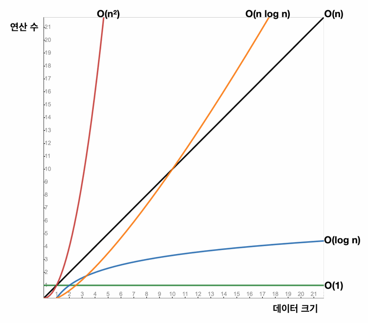
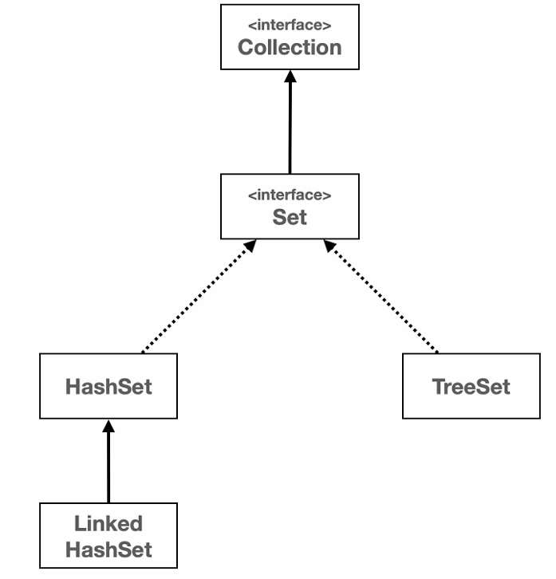
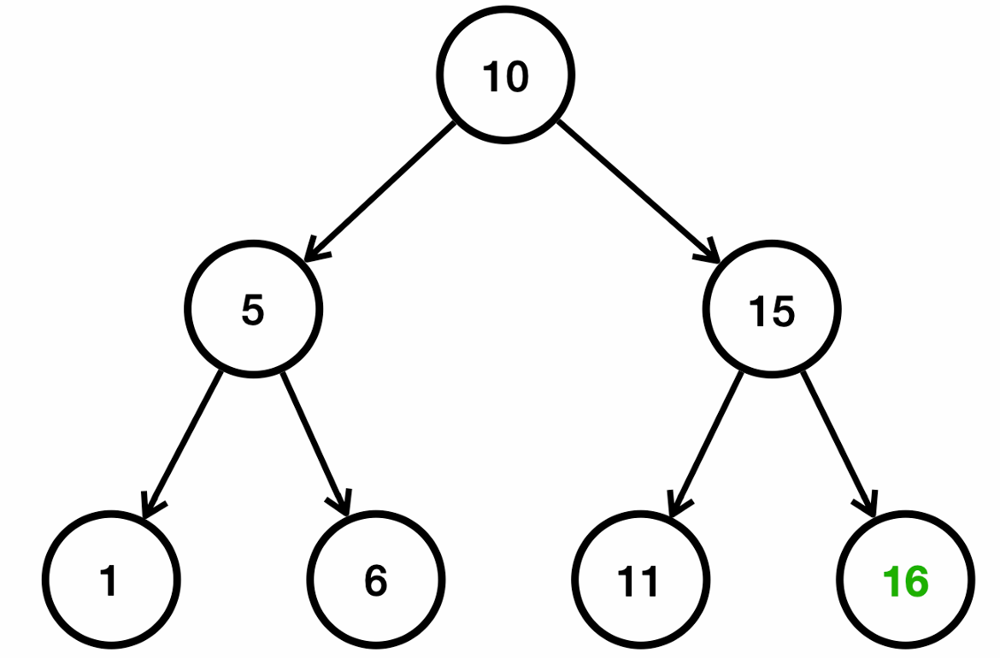
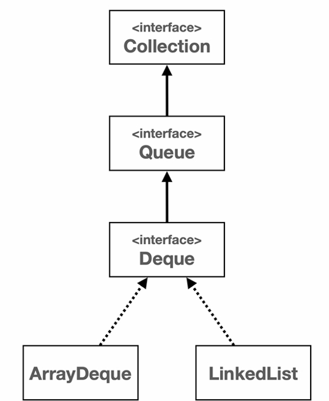

# 1. 제너릭 Generic
- 제네릭의 핵심은 사용할 타입을 미리 결정하지 않는다는 점이다.
- 클래스 내부에서 사용하는 타입을 클래스를 정의하는 시점에 결정하는 것이 아니라 실제 사용하는 생성 시점에 타입을 결정하는 것이다.
- 제너릭 타입: 클래스, 인터페이스를 정의시에 타입 매개변수를 사용하는 것을 말한다.
- 타입 매개변수: GenericBox<T>에서 T
- 타입인자  GenericBox<Integer> 에서 Integer
- 타입 인자로 기본형은 사용할 수 없다 (int, double..)

## 타입 매개변수 상한
```java
public class AnimalHospital <T extends Animal> {

    private final T animal;

    public AnimalHospital(T animal) {
        this.animal = animal;
    }

    public void checkUp() {
        animal.sound();
    }
}
```

## generic method
- 제네릭 메서드는 인스턴스 메서드와 static 메서드에 모두 적용할 수 있다.
- 제네릭 타입은 static 메서드에 타입 매개변수를 사용할 수 없다. (당연)
```java
public class AnimalMethod {
    public static <T extends Animal> String checkup(T t) {
        return t.sound();
    }
}
```

## wildcard
- 제네릭 타입을 조금 더 편리하게 사용할 수 있는 와일드카드는 여러 타입을 들어올 수 있게 한다.
- 와일드카드는 제네릭 타입이나, 제네릭 메서드를 선언하는 것이 아니다. 와일드카드는 이미 만들어진 제네릭 타입을 활용할 때 사용한다
```java
public class WildcardEx {
    static void printWildcardV2(Box<? extends Animal> box) {
        Animal animal = box.getValue();
        System.out.println("이름 = " + animal.sound());
    }
}
```

## generic method vs wildcard
- 제네릭 타입이나 제네릭 메서드를 정의하는게 꼭 필요한 상황이 아니라면, 더 단순한 와일드카드 사용을 권장한다


## 타입 이레이저
- 제네릭은 자바 컴파일 단계에서만 사용되고, 컴파일 이후에는 제네릭 정보가 삭제된다.
- 쉽게 이야기해서 컴파 전인 자바 바이트코드에는 제네릭의 타입 매개변수가 존재하지만, 컴파일 이후에는 타입 매개변수가 존재하지 않는 것
```java
class EraserBox<T> {
    public boolean instanceCheck(Object param) {
        return param instanceof T; // 오류
    }
    public T create() {
        return new T(); // 오류
    }
}
```

# 자료구조

## 빅오 표기법

- O(1) - 상수 시간: 입력 데이터의 크기에 관계없이 알고리즘의 실행 시간이 일정한다.
- O(n) - 선형 시간: 알고리즘의 실행 시간이 입력 데이터의 크기에 비례하여 증가한다.
- O(n²) - 제곱 시간: 알고리즘의 실행 시간이 입력 데이터의 크기의 제곱에 비례하여 증가한다.
- O(log n) - 로그 시간: 알고리즘의 실행 시간이 데이터 크기의 로그에 비례하여 증가한다.
- O(n log n) - 선형 로그 시간

## 배열
- 인덱스를 통한 입력, 변경, 조회의 경우 한번의 계산으로 자료의 위치를 찾을 수 있다.
- 배열은 메모리 상으로 연속된 위치에 저장되기에 list 와 다르게 자바에서 최적화가 가능하다.
- 배열의 길이를 동적으로 변경할 수 없다.
- 데이터를 추가하는 경우 직접 오른쪽으로 한 칸씩 데이터를 밀어야 한다.

### 배열에 데이터를 추가할 때 위치에 따른 성능 변화
- 배열의 첫번째 위치에 추가 : 모든 데이터를 배열의 크기만큼 한 칸씩 이동해야 한다. 따라서 O(n) 만큼의 연산
- 배열의 중간 위치에 추가 :  O(1 + n/2)  O(n)이 된다.
- 배열의 마지막 위치에 추가 
  - 이 경우 배열이 이동하지 않고 배열의 길이를 사용하면 마지막 인덱스에 바로 접근할 수 있으므로 한번의 계
    산으로 위치를 찾을 수 있고, 기존 배열을 이동하지 않으므로 O(1)이 된다.

# 2. List
- XList 를 Array, Linked 방식 으로 구현 함
```java
package lecture.mid2.list;

public interface XList<T> extends Iterable<T> {

    void add(T item);

    T getIndex(int index);

    int size();

    void put(T item, int index);

    T remove(int index);
}
```

| 기능| 배열 리스트| 연결 리스트|
| --| --| --|
| 앞에 추가(삭제)| O(n) - 106ms|  O(1) - 2ms|
| 평균 추가(삭제)| O(n) - 49ms| O(n) - 1116ms|
| 뒤에 추가(삭제)| O(1) - 1ms| O(1) - 2ms|
| 인덱스 조회| O(1) - 1ms|  O(n) - 평균 439ms|
| 검색|  O(n) - 평균 104ms|  O(n) - 평균 473ms|

## 배열 리스트 vs 연결 리스트
- ArrayList가 실제 사용 환경에서 더 나은 성능을 보여주는 대부분의 경우 배열 리스트가 성능상 유리하다. 이런 이유로 실무에서는 주로 배열 리스트를 기본으로 사용한다.
 만약 데이터를 앞쪽에서 자주 추가하거나 삭제할 일이 있다면 연결 리스트를 고려하자

# 3. Set
- 세트(셋)는 유일한 요소들의 컬렉션이다. (유일성, 순서 미보장, 빠른 검색)

## 동일성과 동등성
- 동일성(Identity): 연산자를 사용해서 두 객체의 참조가 동일한 객체를 가리키고 있는지 확인 (==)
- 동등성(Equality): 메서드를 사용하여 두 객체가 논리적으로 동등한지 확인 (equals())

## equals, hashCode의 중요성
- 해시 자료 구조를 사용하려면 hashCode()도 중요하지만, 해시 인덱스가 충돌할 경우를 대비에서 equals()도 반드시 재정의해야 한다.
- 만약 이를 재정의하지 않으면 Object 가 기본으로 제공하는 인스턴스의 참조를 기반으로 동작하게 된다. 

## 자바에서 제공하는 Set



- HashSet : 해시 자료 구조를 사용해서 요소를 저장한다. O(1) 시간복잡도로 주요연산이 발생하고 순서를 보장하지 않는다.
- LinkedHashSet: HashSet + 입력된 순서를 저장하는 자료구조로 연결링크를 가지게 되어 HashSet 보다 조금 더 무겁다.
- TreeSet:  레드-블랙 트리를 사용하여 정렬된 순서(Comparator)로 저장된다. 주요 연산은 O(log n) 의 시간 복잡도를 가진다. 


### 최적화
- 자바 HashSet은 데이터의 양이 배열 크기의 75%를 넘어가면 배열의 크기를 2배로 늘리고 2배 늘어난 크기를 기준으로 모든 요소에 해시 인덱스를 다시 적용한다.
- 자바 HashSet 은 기본 크기는 16이다.


# 4. Map
- Map 의 키가 바로 Set 과 같은 구조로 실제로 자바에서 HashSet 구현의 대부분은 HashMap 의 구현을 가져다 쓴다. 
```java
public class HashSet<E>
    extends AbstractSet<E>
    implements Set<E>, Cloneable, java.io.Serializable {
    @java.io.Serial
    static final long serialVersionUID = -5024744406713321676L;

    transient HashMap<E, Object> map;
}
```
- HashMap, LinkedHashMap, TreeMap

# 5. Stack: 후입 선출(LIFO, Last In First Out)
- 이렇게 나중에 넣은 것이 가장 먼저 나오는 것을 후입 선출이라 하고, 이런 자료 구조를 스택이라 한다.
- 자바의 Stack 클래스는 내부에서 Vector 라는 자료 구조를 사용한다 (Deque 를 사용하자)

# 7. Queue: 선입 선출(FIFO, First In First Out)
- 후입 선출과 반대로 가장 먼저 넣은 것이 가장 먼저 나오는 것을 선입 선출이라 한다. 이런 자료 구조를 큐(Queue)라 한다.
- LinkedList 는 Deque 와 List 인터페이스 모두 구현한다.


## Deque 자료 구조 (Double Ended Queue)
- Deque 는 양쪽 끝에서 요소를 추가하거나 제거할 수 있는 자료구조이며, Queue, Stack 기능을 모두 포함한다.
- CPU 캐시 최적화 등을 고려할 때 배열을 사용하는 ArrayDeque 가 실제 사용 환경에서 더 나은 성능을 보여
- Deque 를 Stack 으로 사용 (push, pop)
- Deque 를 Queue 로 사용 (offer, poll)
  
# 8. 컬렉션 프레임워크 - 순회, 정렬

## Iterable, Iterator
- 자료 구조의 구현과 관계 없이 모든 자료 구조를 동일한 방법으로 순회할 수 있는 일관성 있는 방법
- Iterable, Iterator 를 사용하면 foreach 문을 사용할 수 있다. 
```java
public interface Iterable<T> {
    Iterator<T> iterator();
}

public interface Iterator<E> {
    boolean hasNext();
    E next();
}
```

## Comparable, Comparator
- 지금은 기본형 배열의 경우 듀얼 피벗 퀵소트(Dual-Pivot QuickSort)를 사용하고, 
- 객체 배열의 경우 팀소트(TimeSort)를 사용한다. 이런 알고리즘은 평균 O(n log n)의 성능을 제공
```java
public interface Comparable<T> {
    int compareTo(T o);
}

public interface Comparator<T> {
    int compare(T o1, T o2);
}
```