# 오브젝트 - 기초편 (조영호)

## 1.1 영화애매 도메인 
> 도메인: 
> 소프트웨어로 구현할 요구사항의 범위

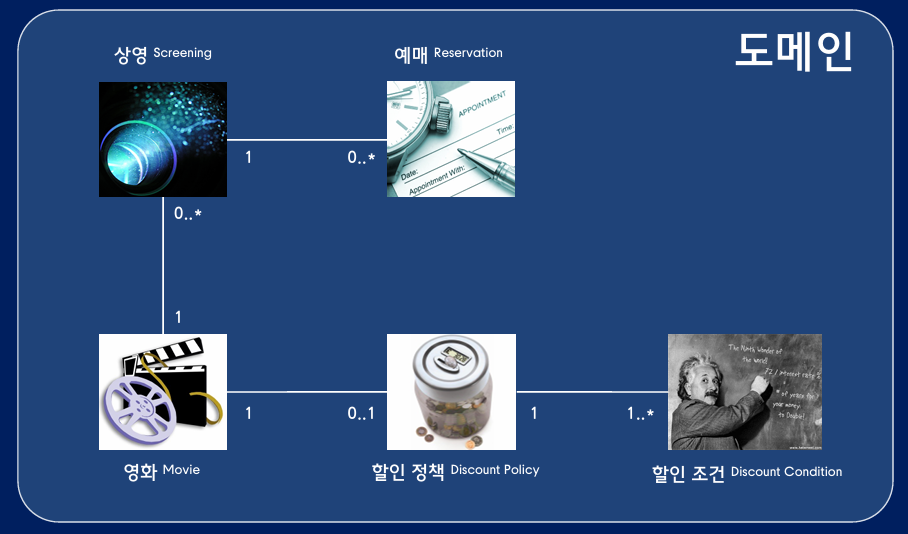

### 절차적인 설계와 객체지향 설계
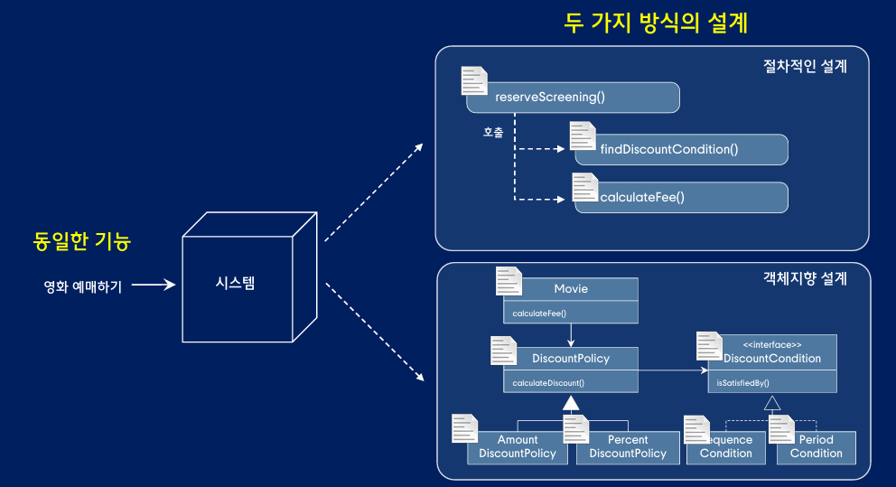

## 2.1 절차적인 설계
- 절차적인 설계는 로직을 실행 순서대로 클래스 안에 배치 

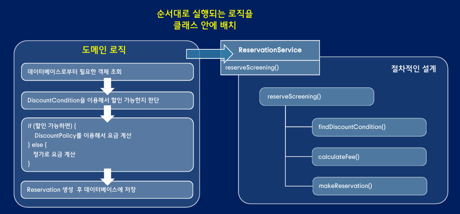

### 절차적인 설계의 핵심
- 데이터가 사용될 `문맥을 고려하지 않은 채` 독립적으로 설계
- 데이터가 완성되면 `외부의 프로세스`에 데이터를 처리하기 위한 로직 구현

## 2.2 변경과 의존성
- 절차적인 설계의 문제점은 요구사항 변경으로 인한 코드에 수정에서 나타난다. 
- 데이터가 변경될 때 외부의 프로세스도 변경되어 사이드 이펙트(부수효과)가 발생한다. 

### 의존성 방향과 변경의 방향
- 변경 방향의 의존성과 반대 
- `ReservationService` 가 Screening, DiscountPolicy, TimeInterval 객체를 의존 하고 있지만,
- 이 클래스들이 변경될 때, `ReservationService` 객체에 변경이 발생 한다.

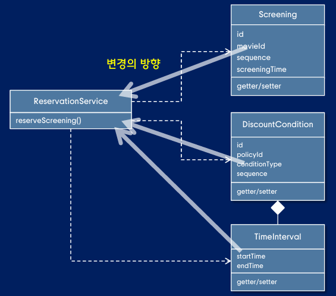

### 데이터와 프로세스 분리
- 절차적인 방식에서는 프로세스와 데이터를 별도의 모듈로 구현
- 의존성 관점에서 프로세스가 데이터의 내부 구조에 결합 (데이터 변경으로 인한 프로세스 수정)

### 전통적인 클래스 캡슐화
- 필드를 Getter/Setter 를 통해 캡슐화는 `내부의 데이터를 그대로 드러내게` 된다. 
- 객체가 사용될 문맥을 고려하지 않고 데이터가 설계되어, 데이터가 변경될 때 수정될 부분을 예측할 수 없다. 
- 데이터를 사용하는 프로세스를 데이터 내부로 이동하는 것이 객체지향 설계의 시작이다.

## 2.3 데이터와 프로세스 통합하기 
- 데이터 변경으로 인한 파급효과를 막는 것이 수정하기 쉬운 설계의 핵심이다. 

### 데이터와 프로세스 통합 
- 데이터를 사용하는 프로세스 로직을 데이터 내부로 이동
- 리펙토링 규칙: 데이터의 getter 를 사용해서 판단하는 로직을 그 데이터로 옮겨라

### 책임의 이동 : 
- 데이터를 이용해서 의사 결정하거나 데이터 상태를 변경하는 로직을 데이터로 책임을 이동시켜라

### 데이터와 객체
- 바보 데이터 객체 : 데이터를 외부에 제공하고 `외부에서 판단하고 결정`하는 `수동적인 존재`
- 똑똑한 객체 : 자기 자신의 `상태를 직접 관리`하고 `스스로 판단하고 결정`하는 `자율적인 존재`

## 2.4 절차에서 객체로 
### 의존성 개수 줄이기
- 여러 객체의 의존하는 객체는 도메인 구조를 이용하여 의존성을 제어할 수 있다. 
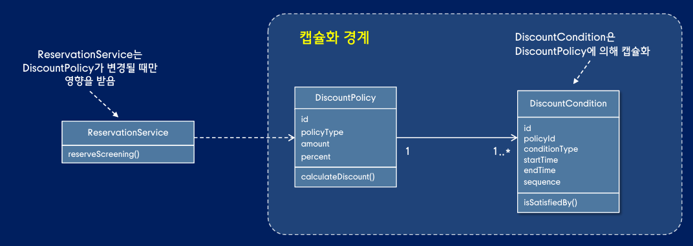

### 책임 주도 설계
- 처음부터 의존성을 고려하여 설계
- 문제의 원인: 사용될 문맥을 고려하지 않고 설계 
- 객체를 똑똑하게 만들기 위해서는 객체가 사용될 문맥이 필요

## 3.1 객체지향 설계 원칙
- 설계란? 코드를 더 쉽게 수정하기 위해 코드를 배치하는 방식
- 설계가 필요한 이유? 요구사항이 변경될 떄 코드를 쉽고 안전하게 수정하기 위해

### 객체지향 설계 원칙
> 1 협력에 필요한 행동을 먼저 결정하고, 행동에 적합한 객체를 나중에 선택하라
> 2 객체의 행동을 먼저 구현하고, 행동에 필요한 데이터를 나중에 선택하라

### 데이터가 아닌 행동에 의존
- 데이터는 생각하지 않고, 외부에 어떤 행동을 제공할지 먼저 결정
- 메서드를 구현하면서 필요한 데이터를 정의
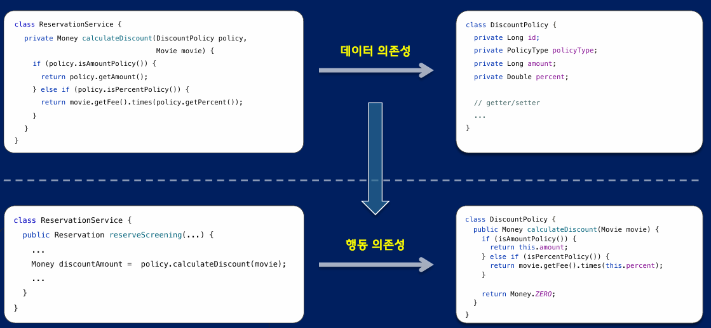

### 객체의 행동
- 객체의 행동의 외부 객체의 요청에 응답하기 위해 결정된다.
- 협력에 필요한 요청에서 행동을 결정하고, 이 행동을 하는 적합한 객체를 결정하여 메서드를 구현하면서 데이터를 결정한다. 
- 코드를 수정하지 않고, 다양한 객체와 협력이 가능하다.
- 외부 코드를 수정하지 않고, 데이터 변경이 가능하다.

### 객체지향 설계 순서
- 객체 협력(런타임)에서 클래스 구조(컴파일)의 순서로 진행
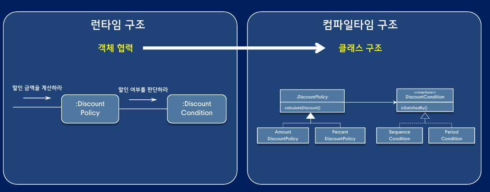

## 3.2 책임 주도 설계
- 협력이 단일 객체를 설계하는 데 필요한 문맥을 제공

### 객체지향 설계 흐름
- 협력을 위한 문맥 결정
- 필요한 책임을 식별
- 책임을 수행할 객체를 선택
- 책임 구현
- 데이터 결정

### 책임 
- 협력에 참여하기 위해 객체가 수행하는 행동
> 하는 것 :   
> 객체를 생성, 계산을 하는 등의 스스로 하는 것  
> 다른 객체의 행동을 시작 하거나, 활동을 제어 하는 것

> 아는 것 :   
> private 로 캡슐화된 상태에 관해 아는 것  
> 관련된 객체를 아는 것

### 책임이 중요한 이유
- 세부사항과 관련된 결정을 뒤로 미루고 객체들의 협력 구조에 초점 
- 협력이 책임을 설계하는데 필요한 문맥을 제공한다. 

### 책임 주도 설계 살펴보기 
- `application`이 제공할 기능을 파악
- `application`의 기능 요구사항을 시스템의 책임으로 변환
- 시스템의 책임을 객체의 책임으로 변환
- 책임을 담당할 적절한 객체를 선택
- 객체의 책임 일부를 수행하기 위해 외부의 도움이 필요하면 다른 객체에게 도움을 요청
- 이 요청을 다른 객체의 책임으로 변환
- 책임을 담당할 적절한 객체를 선택

### 책임 주도 설계의 문맥
- `application` 기능이 협력을 위한 문맥을 제공하고, 협력이 책임을 위한 문맥 제공
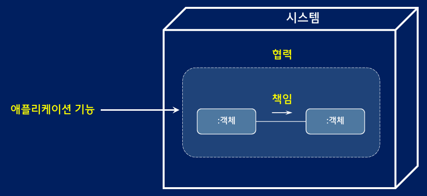

## 3.3 표현적 차이 줄이기
- 알고리즘과 절차적인 설계 : 알고리즘 각 단계를 단일 클래스 안에 실행 순서대로 배치 
- 알고리즘과 객체지향 설계 : 알고리즘 각 단계를 책임 관점에서 여러 객체로 분배

### 표현적 차이
- 도메인에 대한 개념적인 모델과 소프트웨어 구현 사이의 거리 
- 표현적 차이를 줄이는 것은 변경하기 쉬운 유연한 설계를 만들기 위해 
- 도메인의 개념과 기본 구조는 비지니스 변경이 없는 경우 그대로 유지되며, 코드의 위치를 찾기도 유리하다.

### 명사의 가치 
- 객체지향은 명사를 이용해 동사를 묶을 수 있는 개념적 틀을 제공
- 명사를 이용해서 동사 묶기 
  - 동사(책임) : 할인 여부를 판단한다. 
  - 명사(도메인 개념) : 할인 조건
  - 명사+동사(클래스) : DiscountCondition

### GRASP 
- 일반적인 책임 할당을 위한 소프트웨어 패턴 (외울 필요는 없지만 몇가지 패턴은 기억하자)

## 4.1 정보와 책임 할당 

### information expert (정보 전문가)
- 문제: 책임을 객체에게 할당하는 일반적인 원칙
- 해결방법: 책임을 수행하는 데 필요한 정보를 가장 많이 알고 있는 객체에게 할당하라

> 정보는 데이터가 아닌 행동, 어떤 상태를 수정하거나 질문에 답하는 책임

### 객체는 내부 상태보다 행동(책임)이 중요하다. 
- 책임만 유지하면, 내부 구현은 자유롭게 선택할 수 있다. 
- 행동을 결정한 후 데이터를 결정하라

## 4.2 설계 트레이드 오프 
### creator (창조자)
- 문제 : 새로운 인스턴스를 생성하는 책임을 어떤 객체에게 할당할 것인가?
- 해결방법 : 다음 중 한가지라도 만족하는 경우 A 인스턴스 생성하는 책임을 B에게 할당
  - B가 A를 포함하거나 참조한다.
  - B가 A를 기록한다. 
  - B가 A를 긴밀하게 사용한다. 
  - B가 A를 초기화하는 데 필요한 정보를 가지고 있다.

### low coupling (낮을 결합도)
- 문제 : 낮은 의존성을 유지하고, 변경에 따른 영향을 줄이면서, 재사용성을 높일 수 있을까?
- 해결방법 : 설계의 전체적인 결합도를 낮게 유지할 수 있도록 책임을 할당하라.
- 결합도가 낮은 설계를 선택하라 이는 수정하기 쉬운 설계를 만들 수 있다. 

## 4.3 설계 트레이드 오프
### high cohesion (높은 응집도)
- 문제 : 낮은 결합도를 유지하고, 변경에 따른 영향을 줄이면서, 재사용성을 높일 수 있을까?
- 해결방법 : 높은 응집도를 유지하도록 책임을 할당하라. 

### 높은 응집도 의미
- 한 요소의 책임들이 얼마나 강력하게 관련되고 집중되어 있는가?
- 연관성 높은 책임들을 가지면서 너무 많은 일을 하지 않는 객체에 책임 할당

## 4.4 유연한 설계 (다형성)
### 다형성
- 문졔 : 타입을 기반으로 유사하지만 서로 다르게 행동할 때, 조건문을 사용하지 않고 변하는 행동을 어떻게 처리할 것인가?
- 해결방법 : 다형적인 메시지를 이용해서 행동이 변하는 타입들에게 각 행동을 다루기 위한 책임을 할당하라.

> 서로 다른 책임이 하나의 후보 안에 뭉쳐 있다면, 서로 다른 타입의 객체에 할당

## 4.5 결합도 낮추기 
### 메시지 
- 객체들이 협력하기 위해 사용할 수 있는 유일한 의사소통 수단.
- 객체는 다른 객체에게 협력을 요청하기 위해 메시지를 전송

### protected variation (변경 보호)
- 문졔 : 요소들의 변화나 불안정한 요소가 다른 요소에 해로운 영향을 미치지 않도록 할 수 있을까?
- 해결방법 : 변화가 예상되거나 불안전한 지점에 안정적인 인터페이스 or 추상화를 형성하도록 책임을 할당 

> 메시지가 동일하더라도 수신한 객체의 타입에 따라 수행하는 행동이 달라지는 것 

### 역할
- 다른 것으로 대체할 수 있는 책임의 집합
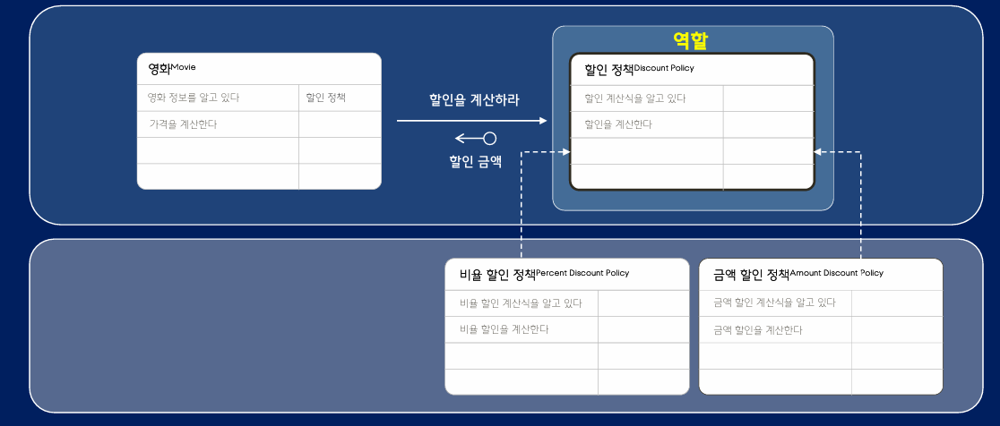

### 책임 주도 설계 구성 요소
- 역할, 책임, 협력 
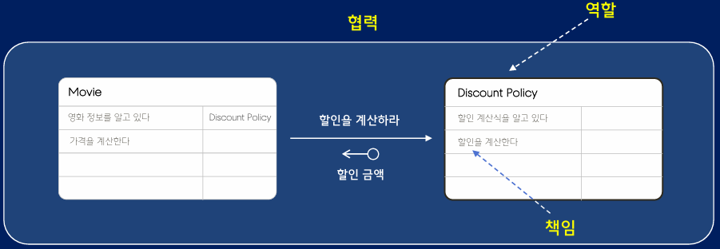

## 5.1 객체 구현하기

### 절차적인 방식과 객체지향 방식 차이
- 절차적인 방식 : 사용되는 문맥을 모르는 상태에서 추측에 기반한 getter/setter 추가
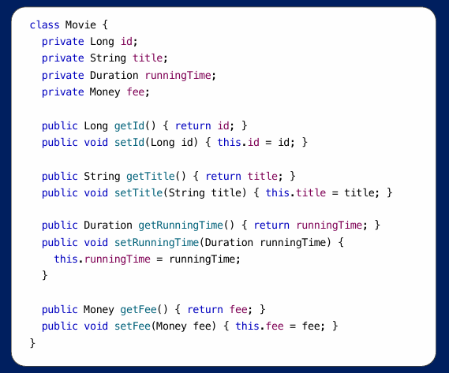
- 객체지향적인 방식 : 협력을 설계하면서 꼭 필요한 경우에만 추가 
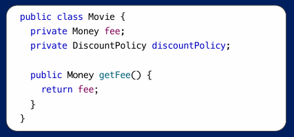

### 클래스와 도메인 설계
- 표현적 차이를 줄여서 수정할 코드는 쉽게 찾을 수 있다.
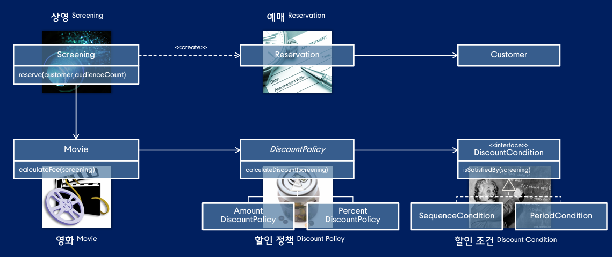

## 5.2 메시지와 메서드의 분리
- 메시지 : 객체 사이의 의사소통 수단 (다른 객체에게 책임 수행을 요청)
- 메서드 : 메시지를 처리하는 방법
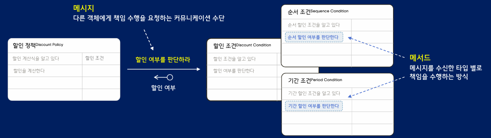

## 5.3 유연하고 일관적인 협력
### 메시지와 메서드 분리 장점
- 변경의 파급효과를 제어할 수 있기 때문에 기존 코드를 수정하지 않고도 기능 확장
- 일관성 있는 설계, 확장하고 예측하기 쉬운 설계 가능 
- `변경하기 쉬운 코드`

## 5.4 애플리케이션 객체 추가하기 

### indirection (간접화)
- 문제 : 직접적인 의존을 피하기 위해 어디에 책임을 할당하는가?
- 해결방법 : 다른 컴포넌트나 서비스가 직접 의존하지 않도록 중재하는 중간 객체에 책임 할당

### pure fabrication (순수 가공물)
- 문제 : 적당한 책임을 가진 클래스를 찾지 못하는 상황이거나 높은 응집도와 낮은 결합도를 위반하고 싶지 않은 경우에 누구에게 책임을 할당해야 하는가?
- 해결방법 : 도메인 개념을 표현하지 않은 인위적으로 만든 클래스에 책임을 할당하라.
- 이런 클래스는 높은 응집도, 낮은 결합도, 재사용을 지원하기 위해 만들어진다.

### Controller 
- 문제 : UI 계층을 통해 전달되는 시스템의 오퍼레이션을 전달받고 조정할 최초의 객체는 무엇인가?
- 해결방법 : 워크플로어를 표현하는 객체에게 책임을 할당하라

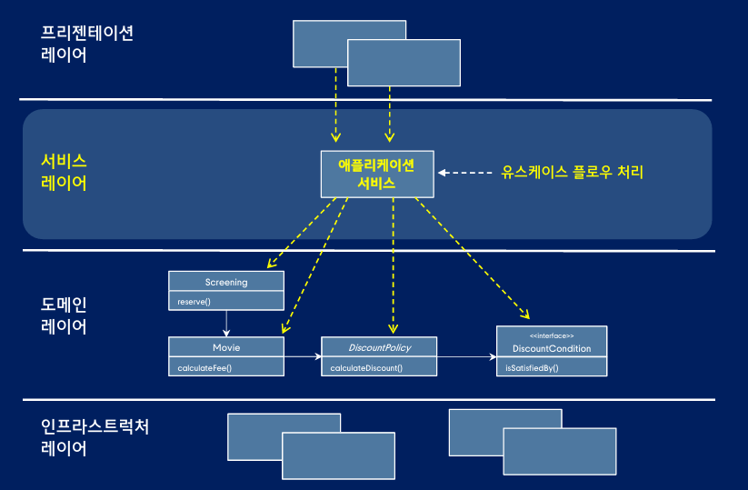

### 데이터 접근 객체 

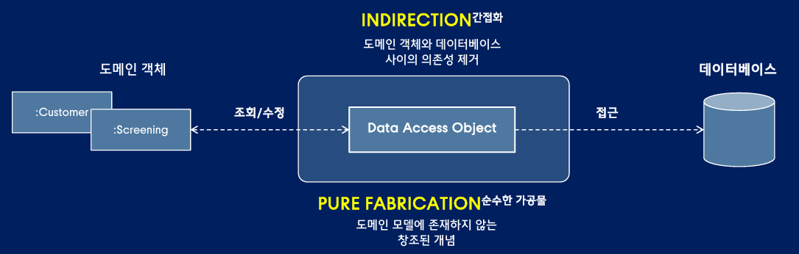

## 6.1 변경과 설계
### 훌륭한 설계? 
- 응집도가 높고, 결합도 낮고, 캡슐화를 지키도록 코드를 배치하는 것
- 변경하기 쉽게 코드를 배치하는 것

### 응집도 
- 모듈 클래스 내부 요소들 사이의 기능적인 집중도
- 모듈 클래스 내부의 데이터와 메서드간에 관련된 정도

### 결합도 
- 모듈이 외부의 다른 모듈에 의존하는 정도
- 모듈이 다른 모듈에 대해 알고 있는 지식의 양 

### 캡슐화 
- 내부의 데이터와 메서드를 하나의 단위로 묶음 
- 외부로부터 데이터에 대한 직접적인 접근 제한
- 공융 인터페이스를 통한 접근만 허용

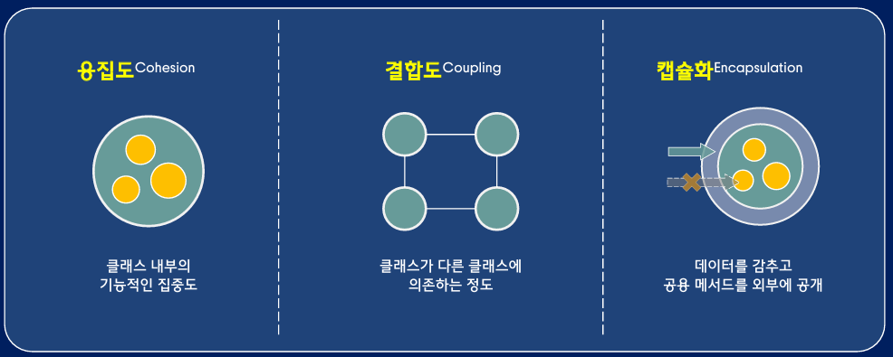

### 프로그램 의무
- 오늘 완성해야 하는 기능을 구현하는 코드를 작성하는 동시에 내일 쉽게 변경할 수 있는 코드를 작성해야 한다. 

## 6.2 응집도
### 변경 관점
- 모듈 내부 요소들이 함께 변경되는 정도 
- 낮은 응집도 : 모듈 전체가 동일한 이유로 변경
- 높은 결합도 : 모듈 각 부분이 서로 다른 이유로 변경 
- 변경의 시점과 속도가 중요, 변경의 이유가 동일

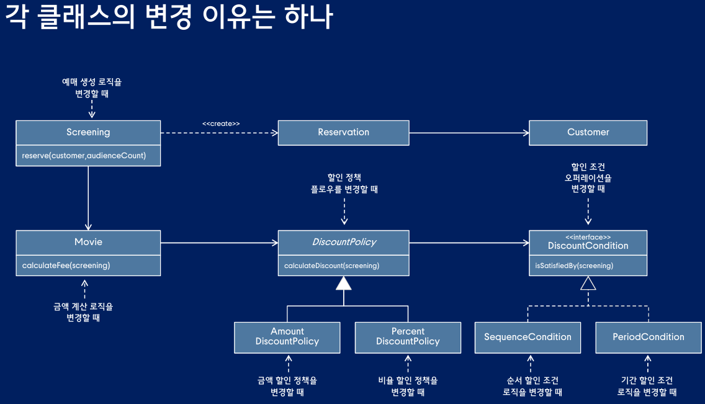

### 단일책임원칙 (SRP)
- 각 클래스는 단 하나의 이유로 변경되어야 한다. 
- 변경의 이유를 기준으로 클래스의 크기를 정하라.

### 응집도 높이는 방법
- 변하는 이유가 다른 코드 들을 서로 다른 모듈로 분리하라.
- 함께 사용되는 메서드와 속성 그룹으로 클래스를 분리하라.
- 초기화되는 속성의 그룹을 기준으로 클래스 분리

## 6.3 결합도
### 변경 관점
- 외부의 다른 모듈에 의해 함께 변경되는 정도
- 높은 결합도 : 외부 모듈이 변경될 때 함께 변경되는 빈도가 높음
- 낮은 결합도 : 외부 모듈이 변경될 때 함께 변경되는 빈도가 적음

### 의존성과 결합도
- 의존성은 있다/없다 개념으로 특정한 경우에 함께 변경될 수 있지, 항상 같이 변경된다는 의미는 아님
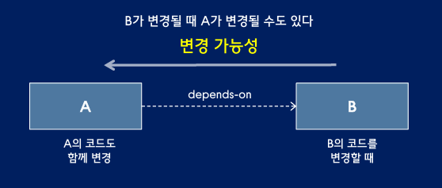

### 결합도 낮추기
- 자주 변하지 않는 안정적인 부분에 의존하기
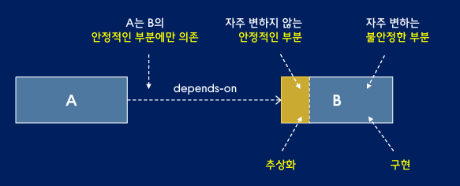

## 6.4 캡슐화
### 변경 관점
- 변경되는 부분을 내부로 숨기는 추상화 기법
- 변경될 수 있는 어떤 것이라도 감추는 것
- 설계에서 변하는 부분이 무엇인지 고민하고 변하는 개념을 캡슐화 
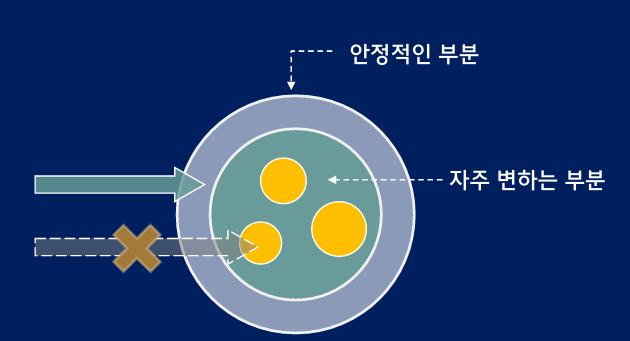

### 의존성 역전 원칙 (DIP)
- 상위 모듈은 하위 모듈에 의존하면 안 된다.
- 구현체(Concrete) 말고 인터페이스(Abstraction)를 바라봐라.

### 리스코프 치환 원칙 
- 서브 타입은 언제나 기반 타입(부모 클래스)으로 교체할 수 있어야 한다
- 자식 클래스는 부모 클래스의 역할을 망치지 않고 대체할 수 있어야 해.

### 개방 폐쇄 원칙
- 확장에는 열려(Open) 있어야 하고, 변경에는 닫혀(Closed) 있어야 한다
- 새로운 기능을 추가할 땐 코드를 고치지 말고 코드를 "확장"해서 추가하라는 거야.

